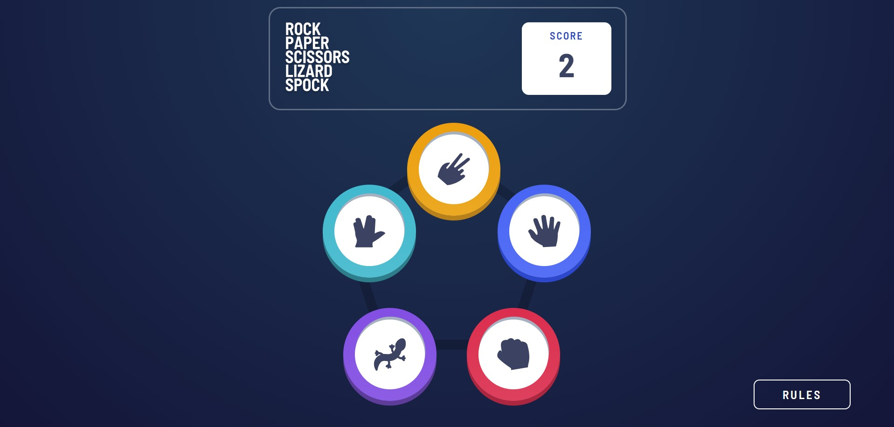

# Frontend Mentor - Rock, Paper, Scissors solution

This is a solution to the [Rock, Paper, Scissors challenge on Frontend Mentor](https://www.frontendmentor.io/challenges/rock-paper-scissors-game-pTgwgvgH).

## Table of contents

- [Frontend Mentor - Rock, Paper, Scissors solution](#frontend-mentor---rock-paper-scissors-solution)
  - [Table of contents](#table-of-contents)
  - [Overview](#overview)
    - [The challenge](#the-challenge)
    - [Screenshot](#screenshot)
    - [Links](#links)
  - [My process](#my-process)
    - [Built with](#built-with)
  - [Author](#author)

## Overview

### The challenge

Users should be able to:

- View the optimal layout for the game depending on their device's screen size
- Maintain the state of the score after refreshing the browser
- Play Rock, Paper, Scissors, Lizard, Spock against the computer

### Screenshot

### Links

- Solution URL: [Add solution URL here](https://your-solution-url.com)
- Live Site URL: [Add live site URL here](https://your-live-site-url.com)

## My process

### Built with

- Semantic HTML5 markup
- CSS custom properties
- SASS/SCSS
- [React](https://reactjs.org/) - JS library
- [Framer Motion](https://www.framer.com/motion/) - Motion library

## Author

- Frontend Mentor - [@nastaj](https://www.frontendmentor.io/profile/nastaj)
